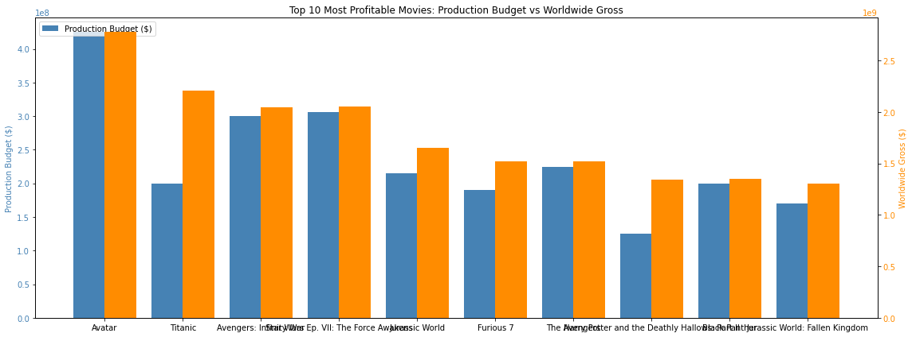
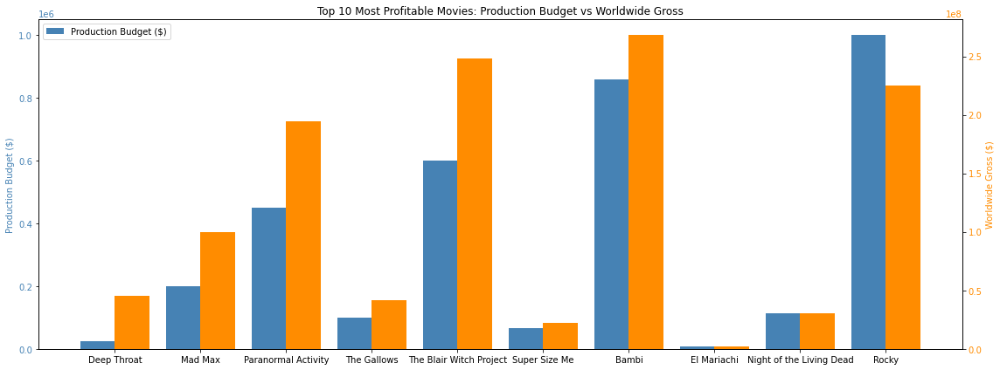
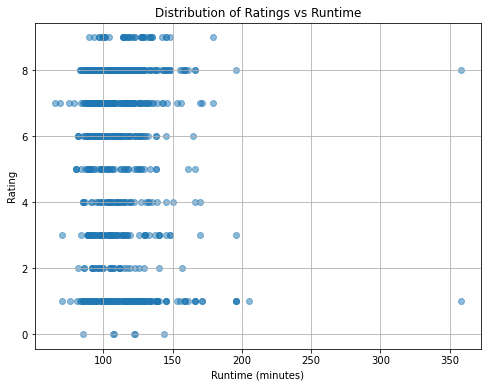
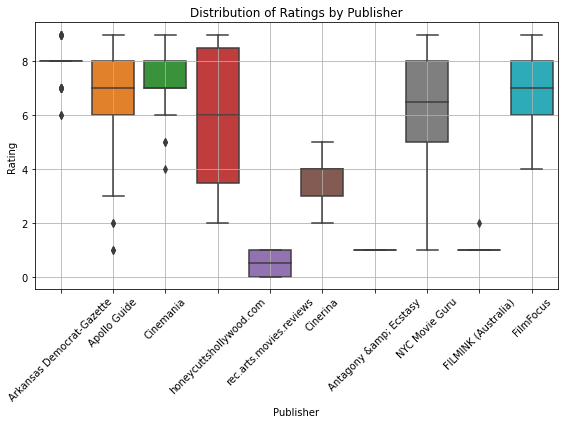
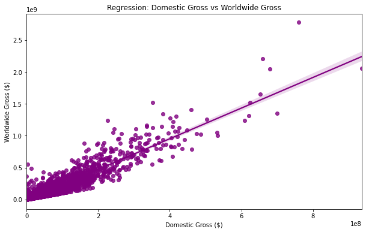
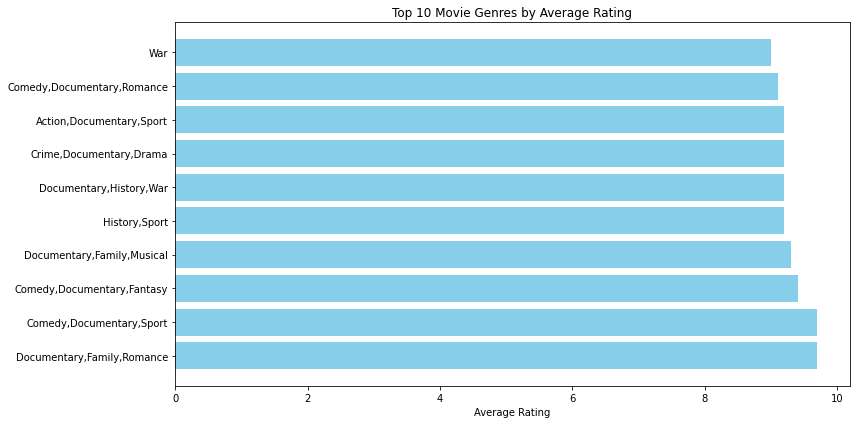

# Group_8_phase_2_project

# Project Overview

With the company’s strategic decision to enter the movie industry through the establishment of its own movie studio, our team has been assigned to conduct a data-driven exploration of the current film market. Using the datasets provided, we aim to analyze recent trends in the film industry to identify which types of films are performing best across various key performance indicators such as box office revenue, audience ratings, genre popularity, and critical acclaim.

The insights derived from this analysis will guide the decision-making process for the new studio, helping determine the best types of films to produce in order to maximize return on investment and market success. Ultimately, we aim to make strategic recommendations from these insights.

# Business Understanding

We aim to provide data-backed insights that will inform the company’s entry strategy into the movie industry. We believe this will ensure that the newly established movie studio invests in movie genres that have proven commercial and critical success.

By leveraging proven trends in the film industry, we can ensure that the company reduces the risks associated with new ventures and also position the newly establised studio for early success in a very competitive market.

# Objectives 
The main objectives for the study are:

1.**Quantify Movie Profitability** - Use financial data (production budgets and worldwide gross) to compute Return on Investment (ROI) and identify the most and least profitable films.

2.**Analyze Movie Ratings** - Explore ratings data to understand if and how factors such as runtime, publisher influence critical scores and genre correlate to movie ratings.

3.**Find blockbuster movies globally** - We aim to find movies that performed exceptionally not only domestically but also worldwide using the worldwide_gross data

4.**Investigate the runtime vs movie rating** - Find out whether the average runtime of a movie has any influence on the movie ratings.

# 1. Data Understanding
In this notebook, we explore multiple movie-related datasets to understand their structure and prepare them for further analysis. This includes data from **TMDb**, **The Numbers**, **Box Office Mojo**, and **Rotten Tomatoes**.

First we import the relevant python libraries and loading the datasets.
- `tmdb_movies`: Movies from The Movie Database (TMDb)
- `tn_movie_budgets`: Budget and revenue data from The Numbers
- `rt_reviews`: Movie reviews from Rotten Tomatoes
- `rt_movie_info`: Additional Rotten Tomatoes metadata

We explore each dataset using the imported libraries to get a glimpse of the columns present in each dataset as the shapes of the DataFrames present using methods such as; `.head()`, `.info()`, and `.tail()`.This gives us a brief understanding of what each dataset entails.
# 2. Data cleaning 
In order to perform calculations and visualizations thereafter we first prepare our raw data. We remove missing values. We drop irrelevant columns and merge some datasets with common columns to get a comprehensive view. This is the data cleaning process outlined in the following cells.
  - Cleaning Financial Figures - normalizing the data by removing currency symbols and commas, hence changing the data type to float for easier mathematical calculations.
  - Creating a ROI(Return On Investment) column by subracting production budget from worldwide gross then dividing by production budget. This helps us know which movies were profitable and those that were not.
  - Merging movie datasets - Combining the `tmdb_movies` and `tn_movie_budgets` datasets allows for more comprehensive analysis by utilizing the attributes from TMDb and the financial details from The Numbers.

# 3. Visualizations
  In order to observe trends and patterns from the datasets we construct various visualizations that will help to provide insights later on. We imported the various python libraries required for plotting.

  ## 📊  Top 10 Profitable Movies
  **Visualization of financial data using profit**
  - Comparing worldwide gross with production budget to visualize the profit the movies made.
      
  **Visualization of financial data using ROI**

  - Comparing the production budget to ROI enables us to cater for movies like "Deep throat" that had significantly lower production     budgets and did not make alot of profit compared to movies like Avatar but made very high ROI because of the low productuction budget.
    
      
  ## 🎬 Comparing the ratings to runtime using Rotten tomatoes data
  We cleaned and merged the `rt_reviews` and `rt_movie_info` datasets using movie `id`. This allowed us to explore relationships between movie ratings, runtime, and publisher reviews. These plots help to identify patterns in critical reviews based on runtime or reviewing source 
  We construct the following visualizations:

  - **Scatter Plot** Shows the distributon of runtime against the rating.
    
  - **Bar Plot**  Shows the average Runtime by Rating.
    
    
  - **Boxplot** Shows Ratings by Publisher
    

    ### Key Findings:
- **Scatter Plot:** Showed that most movies fall within a typical runtime range (80–120 minutes), and their ratings vary with some outliers.
- **Bar Plot of Avg. Runtime by Rating:** Indicates that higher-rated films tend to be slightly longer on average.
- **Boxplot of Ratings by Publisher:** Shows potential bias across different review publishers.

  ## 4.Statistical analysis.
To confirm our insights we conduct statisctical analysis to confirm whether our conclusions are valid.These incluse:

**linear regression**  and **Z test**
In this section we use different statistical packages in python namely "sklearn", "scipy" and "statsmodels"

### Conclusion
This shows that there's a **positive correlation**.
Positive Correlation:
The regression line typically slopes upward, indicating a positive relationship — as domestic gross increases, worldwide gross tends to increase too.

Fit of the Line (Rough Visual R²):
If most of the data points hug the regression line closely, the relationship is strong, and domestic gross is a good predictor of worldwide gross.
If the points are widely scattered, the relationship is weaker, and other factors (like international appeal, genre, or marketing) also play a big role.

**Outliers**:
You can see some movies far above the line, it means those films performed much better internationally than locally.
If a few are below the line, those movies underperformed internationally compared to their domestic performance.

### Genre against rating analysis (SQL)
In this part we use the im.db data whish is in SQL format to compare the movie ratings with the genre of the movie.
Since we had loaded the datast before we get into it to view the tables. Here we join tables, compare and provide visualizations.
- Genres vs rating to check for genres that typically have higher ratings than others

- Average runtime vs rating to see if the movie rating is affected by its runtime

